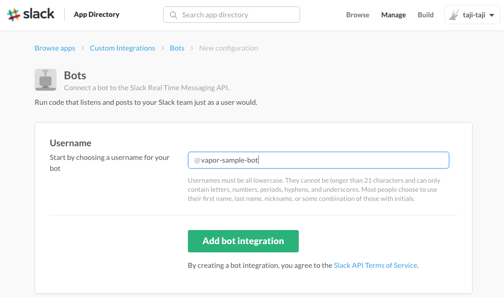
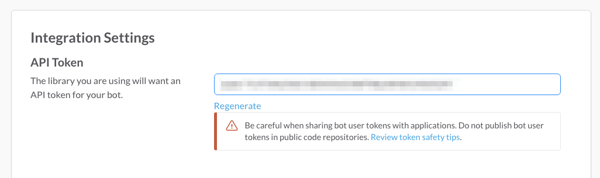

# Swift Trend Bot

This is a Slack bot that will notify you the Swift Trending Repositries of Github.  
This is written with [Vapor](https://github.com/vapor/vapor).

# Set up

## 1. Install Vapor

If you have not yet installed Vapor, according to the documentation, be sure to install the Vapor.

https://vapor.github.io/documentation/

## 2. Download Source

## 3. Configure Slack Bot

Make your Bot User Accont from the following URL.  

https://my.slack.com/services/new/bot  

"API Token" that can be acquired after creating the account will be used in a later step as an environment variable called `BOT_TOKEN`.

## 4. Create App on Heroku

## 5. Configure the settings of Heroku

## 6. Deploy to Heroku

